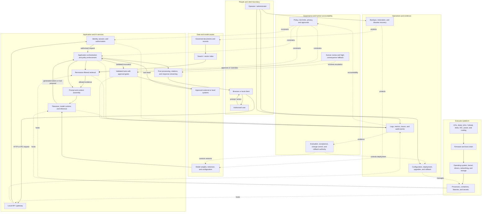

# Full AI Application Stack - Week 0, Version 0

This first-pass conceptual diagram separates the request/data path from the hosting layers, operations, and governance controls. It is intentionally implementation-neutral.

## Boundary assumptions

- The language model proposes text and tool requests; application code enforces identity, permissions, schemas, approvals, and side effects.
- Retrieved content is untrusted input and cannot grant itself authority.
- Governance controls model, data, configuration, deployment, retention, and tool policy rather than existing only as prompt text.
- Observability must diagnose failures without exposing unnecessary private content.
- Physical constraints such as RAM, VRAM, storage, power, cooling, and network capacity affect every service above them.
